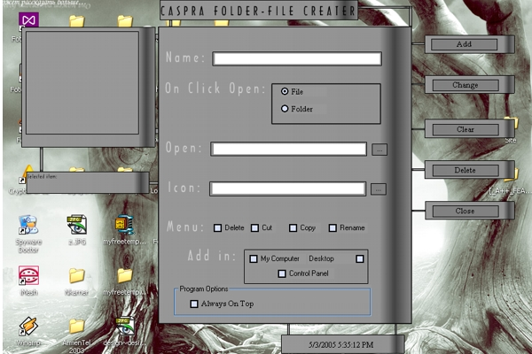



## Create folder\-file in My computer,Control Panel\.\.\.

### Description

It Creates Folders-Files in My Computer,Desktop And Control Panel,you also can give what you want to see in right-click menu.I think you will like it. Sorry for bad english and thank you.
 
### More Info
 

             |
---                |---
**Submitted On**   |2003-07-07 21:08:48
**By**             |[Grenik Poghosyan](https://github.com/Planet-Source-Code/PSCIndex/blob/master/ByAuthor/grenik-poghosyan.md)
**Level**          |Intermediate
**User Rating**    |5.0 (30 globes from 6 users)
**Compatibility**  |VB 6\.0
**Category**       |[Complete Applications](https://github.com/Planet-Source-Code/PSCIndex/blob/master/ByCategory/complete-applications__1-27.md)
**World**          |[Visual Basic](https://github.com/Planet-Source-Code/PSCIndex/blob/master/ByWorld/visual-basic.md)
**Archive File**   |[Create\_fol188408532005\.zip](https://github.com/Planet-Source-Code/grenik-poghosyan-create-folder-file-in-my-computer-control-panel__1-60338/archive/master.zip)

